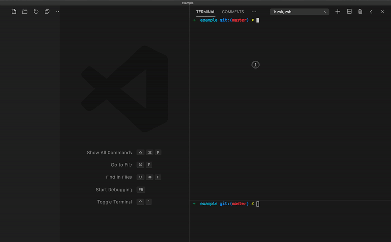

# aoc

Full Advent of Code dev loop in a CLI which:

- Prints challenge description in the terminal
- Downloads input to a file
- Creates a source file for your favourite language and runs it on change
- Submits answers



## Recommended Usage

Install with `npm i -g @jakzo/aoc` (if you prefer you can install a binary from the [Installation](#Installation) section below).

A few minutes before the challenge starts, open two terminals and run these commands:

```sh
# Terminal 1
aoc

# Terminal 2
aoc start js
```

This will prompt you for your session token if you haven't provided it before and save it in your operating system's credential manager.

From here the first terminal will:

- Count down until the challenge starts
- Print the description in the terminal once the challenge starts
- Download the input to a local file called `input.txt`
- Prompt for an answers to submit
- When a correct answer is submitted, repeats these steps for part 2

And the second terminal will:

- Create a new source file for your chosen language (JavaScript in the example)
- Run the created source file and rerun when any changes are saved

## Installation

If you have [Node.js](https://nodejs.org/) installed the easiest way is with:

```sh
npm i -g @jakzo/aoc
```

Or if you prefer you can install the binary for your platform:

### Linux

1. Download `aoc-linux-x64` from the [releases](https://github.com/jakzo/aoc/releases) page
1. `chmod +x aoc-linux-x64`
1. `mv aoc-linux-x64 /usr/local/bin/aoc`

### MacOS

1. Download `aoc-macos-x64` from the [releases](https://github.com/jakzo/aoc/releases) page
1. Give execute permission: `chmod +x aoc-macos-x64 && xattr -d com.apple.quarantine aoc-macos-x64`
1. Add to path: `mv aoc-macos-x64 /usr/local/bin/aoc`

### Windows

1. Download `aoc-win-x64.exe` from the [releases](https://github.com/jakzo/aoc/releases) page
1. Open Command Prompt as administrator then run:
1. `mkdir aoc` (feel free to swap `aoc` for any directory you want to install it to)
1. `move aoc-win-x64.exe aoc\aoc.exe`
1. Add to path: `cd aoc && setx /M PATH "%PATH%;%CD%"`

## Language Templates

See [./templates](./templates) for a list of possible languages. Each folder name is a valid argument you can provide to `aoc start`.

The template files exist at [./templates](./templates) with commands for the template within [./src/templates.ts](./src/templates.ts).

## Individual Commands

The tool also exposes individual commands in case you want to compose some functionality together with another tool. For example you can save the input for a challenge to another file with `aoc input --year 2016 --day 5 > another-file.txt`.

Documentation for individual commands can be found by running `aoc --help`.

Individual commands can also be accessed from the npm module like:

```js
const { printDescription } = require('@jakzo/aoc')

printDescription(2020, 5)
```
